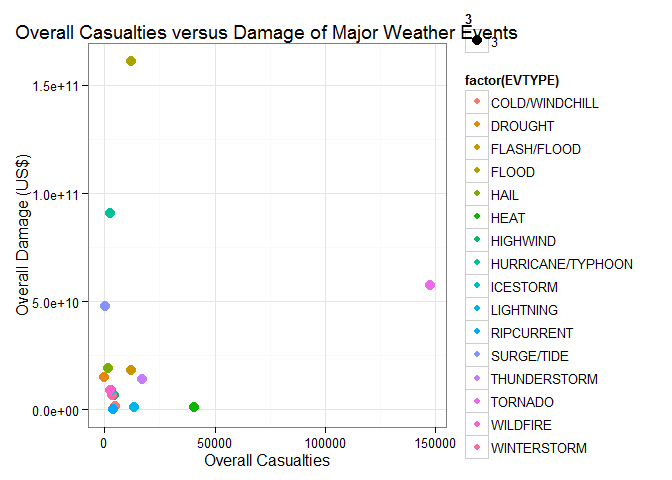
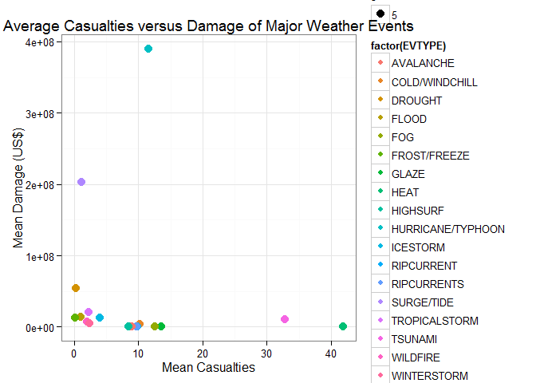

# The Effects of Types of Weather Events in the United States
Baoshi Sun  
Thursday, April 21, 2015  

## Synopsis

The purpose of this report is to analyze the consequences of different types of weather events in the United States based on NOAA Storm Database. The result of analysis consists of the most catastrophic weather events with respect to population health as well as economic situation. It turns out that the tornado caused the greatest casualties among all of the weather events, while the flood  caused the most amount of total economic damage and the HURRICANE/TYPHOON caused the most serious average economic damage. The report also reveals the differences of major types of disaster events regarding population health versus economic damage. 

## Data Processing

### Setting up working environment

* Woking Directory  
A directory named 'RepData_PeerAssessment2' is built as the main working directory of this report.

* Software Packages
To finish the project, a couple of software needs to be installed.   
-- R Version 3.1.3 64bit  
-- RStudio Version 0.98.1103  
The following packages in R are expected to be used:  
-- knitr - markdown tools  
-- plyr, dplyr - manipulating data easier
-- lubridate - data and time processing  
-- ggplot2  

Load necessary packages:   


```r
## load plyr, dplyr, lubridate and ggplot2
library(dplyr)
```

```
## 
## Attaching package: 'dplyr'
## 
## The following object is masked from 'package:stats':
## 
##     filter
## 
## The following objects are masked from 'package:base':
## 
##     intersect, setdiff, setequal, union
```

```r
library(plyr)
```

```
## -------------------------------------------------------------------------
## You have loaded plyr after dplyr - this is likely to cause problems.
## If you need functions from both plyr and dplyr, please load plyr first, then dplyr:
## library(plyr); library(dplyr)
## -------------------------------------------------------------------------
## 
## Attaching package: 'plyr'
## 
## The following objects are masked from 'package:dplyr':
## 
##     arrange, count, desc, failwith, id, mutate, rename, summarise,
##     summarize
```

```r
library(lubridate)
```

```
## 
## Attaching package: 'lubridate'
## 
## The following object is masked from 'package:plyr':
## 
##     here
```

```r
library(ggplot2)
```

### Loading the Raw Data

Only on the first time, we need to download the compressed data package from source at:
https://d396qusza40orc.cloudfront.net/repdata%2Fdata%2FStormData.csv.bz2,
and decompress it into csv data file named StormData.csv.   

Everytime afterward, code should check the existance of the data file.


```r
fileURL <- "https://d396qusza40orc.cloudfront.net/repdata%2Fdata%2FStormData.csv.bz2"
destfn <- "StormData.csv"
if (!file.exists(destfn)) {
    ## Download the data file
    download.file(fileURL, destfile=destfn)
}

## Read cvs file
data.raw <- read.csv(destfn, stringsAsFactors=FALSE, strip.white=TRUE, blank.lines.skip=TRUE)
```

Make an brief exploration on the raw data:  


```r
dim(data.raw)
```

```
## [1] 902297     37
```

```r
names(data.raw)
```

```
##  [1] "STATE__"    "BGN_DATE"   "BGN_TIME"   "TIME_ZONE"  "COUNTY"    
##  [6] "COUNTYNAME" "STATE"      "EVTYPE"     "BGN_RANGE"  "BGN_AZI"   
## [11] "BGN_LOCATI" "END_DATE"   "END_TIME"   "COUNTY_END" "COUNTYENDN"
## [16] "END_RANGE"  "END_AZI"    "END_LOCATI" "LENGTH"     "WIDTH"     
## [21] "F"          "MAG"        "FATALITIES" "INJURIES"   "PROPDMG"   
## [26] "PROPDMGEXP" "CROPDMG"    "CROPDMGEXP" "WFO"        "STATEOFFIC"
## [31] "ZONENAMES"  "LATITUDE"   "LONGITUDE"  "LATITUDE_E" "LONGITUDE_"
## [36] "REMARKS"    "REFNUM"
```

```r
str(data.raw)
```

```
## 'data.frame':	902297 obs. of  37 variables:
##  $ STATE__   : num  1 1 1 1 1 1 1 1 1 1 ...
##  $ BGN_DATE  : chr  "4/18/1950 0:00:00" "4/18/1950 0:00:00" "2/20/1951 0:00:00" "6/8/1951 0:00:00" ...
##  $ BGN_TIME  : chr  "0130" "0145" "1600" "0900" ...
##  $ TIME_ZONE : chr  "CST" "CST" "CST" "CST" ...
##  $ COUNTY    : num  97 3 57 89 43 77 9 123 125 57 ...
##  $ COUNTYNAME: chr  "MOBILE" "BALDWIN" "FAYETTE" "MADISON" ...
##  $ STATE     : chr  "AL" "AL" "AL" "AL" ...
##  $ EVTYPE    : chr  "TORNADO" "TORNADO" "TORNADO" "TORNADO" ...
##  $ BGN_RANGE : num  0 0 0 0 0 0 0 0 0 0 ...
##  $ BGN_AZI   : chr  "" "" "" "" ...
##  $ BGN_LOCATI: chr  "" "" "" "" ...
##  $ END_DATE  : chr  "" "" "" "" ...
##  $ END_TIME  : chr  "" "" "" "" ...
##  $ COUNTY_END: num  0 0 0 0 0 0 0 0 0 0 ...
##  $ COUNTYENDN: logi  NA NA NA NA NA NA ...
##  $ END_RANGE : num  0 0 0 0 0 0 0 0 0 0 ...
##  $ END_AZI   : chr  "" "" "" "" ...
##  $ END_LOCATI: chr  "" "" "" "" ...
##  $ LENGTH    : num  14 2 0.1 0 0 1.5 1.5 0 3.3 2.3 ...
##  $ WIDTH     : num  100 150 123 100 150 177 33 33 100 100 ...
##  $ F         : int  3 2 2 2 2 2 2 1 3 3 ...
##  $ MAG       : num  0 0 0 0 0 0 0 0 0 0 ...
##  $ FATALITIES: num  0 0 0 0 0 0 0 0 1 0 ...
##  $ INJURIES  : num  15 0 2 2 2 6 1 0 14 0 ...
##  $ PROPDMG   : num  25 2.5 25 2.5 2.5 2.5 2.5 2.5 25 25 ...
##  $ PROPDMGEXP: chr  "K" "K" "K" "K" ...
##  $ CROPDMG   : num  0 0 0 0 0 0 0 0 0 0 ...
##  $ CROPDMGEXP: chr  "" "" "" "" ...
##  $ WFO       : chr  "" "" "" "" ...
##  $ STATEOFFIC: chr  "" "" "" "" ...
##  $ ZONENAMES : chr  "" "" "" "" ...
##  $ LATITUDE  : num  3040 3042 3340 3458 3412 ...
##  $ LONGITUDE : num  8812 8755 8742 8626 8642 ...
##  $ LATITUDE_E: num  3051 0 0 0 0 ...
##  $ LONGITUDE_: num  8806 0 0 0 0 ...
##  $ REMARKS   : chr  "" "" "" "" ...
##  $ REFNUM    : num  1 2 3 4 5 6 7 8 9 10 ...
```

As can be noticed, the following variables need to be prepcessed in order to :   
- EVTYE: according to the National Weather Service (Source: https://d396qusza40orc.cloudfront.net/repdata%2Fpeer2_doc%2Fpd01016005curr.pdf), event type should be classified into 48 catagories. However, there are many mistakes (for example: prefix, surfix or spaces) which make values of this variable not standard        
- PROPDMGEXP & CROPDMGEXP: should be alphabetical characters used to signify magnitude include "K" for thousands, "M" for millions, and "B" for billionsonly   


### Processing the Raw Data

In order to process data efficently, dplyr package is used and the loaded raw data  is assigned to data table with the name of stormdata. In addition, we only reserve the variables those relative to the analysis.


```r
stormdata <- tbl_df(data.raw)
stormdata <- select(stormdata, STATE, BGN_DATE, BGN_TIME, EVTYPE, FATALITIES, INJURIES, PROPDMG, PROPDMGEXP, CROPDMG, CROPDMGEXP, WFO)

## View the data
stormdata
```

```
## Source: local data frame [902,297 x 11]
## 
##    STATE           BGN_DATE BGN_TIME  EVTYPE FATALITIES INJURIES PROPDMG
## 1     AL  4/18/1950 0:00:00     0130 TORNADO          0       15    25.0
## 2     AL  4/18/1950 0:00:00     0145 TORNADO          0        0     2.5
## 3     AL  2/20/1951 0:00:00     1600 TORNADO          0        2    25.0
## 4     AL   6/8/1951 0:00:00     0900 TORNADO          0        2     2.5
## 5     AL 11/15/1951 0:00:00     1500 TORNADO          0        2     2.5
## 6     AL 11/15/1951 0:00:00     2000 TORNADO          0        6     2.5
## 7     AL 11/16/1951 0:00:00     0100 TORNADO          0        1     2.5
## 8     AL  1/22/1952 0:00:00     0900 TORNADO          0        0     2.5
## 9     AL  2/13/1952 0:00:00     2000 TORNADO          1       14    25.0
## 10    AL  2/13/1952 0:00:00     2000 TORNADO          0        0    25.0
## ..   ...                ...      ...     ...        ...      ...     ...
## Variables not shown: PROPDMGEXP (chr), CROPDMG (dbl), CROPDMGEXP (chr),
##   WFO (chr)
```

Then we can weed out the rows those have no corresponding consequence values.


```r
stormdata <- filter(stormdata, FATALITIES!=0 | INJURIES!=0 | PROPDMG!=0 | CROPDMG!=0)
nrow(stormdata)
```

```
## [1] 254633
```

### Standardization of PROPDMGEXP & CROPDMGEXP

Check the records whose value of PROPDMGEXP (or CROPDMGEXP) is not 'K', 'M' or 'B'.   


```r
tmpdata <- stormdata[!(stormdata$PROPDMGEXP %in% c("K", "M", "B"))  & stormdata$PROPDMG > 0,]
errcount <- nrow(tmpdata)
factor(tmpdata$PROPDMGEXP)
```

```
##   [1] m + + 0 0 0 0 +   0 0 0 0 0 5 0 0 0 0 0 0 0 0 0 0 0 5 0 0 0 5 0 0 0 0
##  [36] 0 m 0 0   0 0 0 0 0 0 0 0 0 0 0 0 0 0 0 0 0 0 0 0 0 0 0 0 0 0 0 0 0 0
##  [71] 0 0 0 0 0 0   0 m 0 0 0 0 0 0 0 0 0 0 0 0 0 0 0 0 0 0 0 0 0 0   0 0 0
## [106] 0 0 0 0 0 0 0 0 0 0 0 0 0 0 0 0 0 0 0 0 0 0 0 0 0 0 0 0 0 0 0 0 0 0 0
## [141] 0 0 0 0 0 0 0 0 0 0 0 0 0 0 0 0 0 0 0 0 0 0 0 0 0 0 0 0 0 0 0 0 0 0 0
## [176] 6 5 5 0 5 6 6 5 5 4       0     0 0 0 0 5       m m         m 0 5 0 0
## [211] 0 h     m   0 2 7 0 0 0 3 0 0 5 0 4 H + +     5 7 0 0                
## [246]                                                                      
## [281]         0     - 0 5 4 0 0 H H   H 5     0 5 0 0   5 4 0 0 0 0 0 0 0 0
## [316] 0   0 0 5 0 0 0 0 0 0 5 0 0 0 0   H H
## Levels:  - + 0 2 3 4 5 6 7 h H m
```

There are 334 error fields need to fix. The following methods are applied:   
-- replace 'k', 'm' and 'b' (lower case) with 'K, 'M' and 'B' respectively  
-- replace other error values with 'K' (assumming typo or missing)  


```r
exp_KMB <- c("k"="K", "m"="M", "b"="B")
stormdata$PROPDMGEXP <- revalue(stormdata$PROPDMGEXP, exp_KMB, warn_missing=FALSE)
stormdata$PROPDMGEXP[!(stormdata$PROPDMGEXP %in% c("K", "M", "B")) & stormdata$PROPDMG > 0] <- "K"


stormdata$CROPDMGEXP <- revalue(stormdata$CROPDMGEXP, exp_KMB, warn_missing=FALSE)
stormdata$CROPDMGEXP[!(stormdata$CROPDMGEXP %in% c("K", "M", "B")) & stormdata$CROPDMG > 0] <- "K"
```


### Event Type Standardization

There are a lot of errors for EVTYPE variable. We should make up the errors with common sense, but avoid introducting arbitary bias. The rules are listed below (in order):   
-- all to upper case  
-- remove all spaces  
-- all containing THUNDERSTORM -> THUNDERSTORM  
-- all containing TSTM -> THUNDERSTORM  
-- all containing TORNADO -> TORNADO  
-- all containing COLD or WINDCHILL -> COLD/WINDCHILL  
-- all containing DROUGHT -> DROUGHT  
-- all containing FLASH and FLOOD -> FLASH/FLOOD  
-- all containing FLOOD but no FLASH -> FLOOD  
-- all containing FROST or FREEZE -> FROST/FREEZE  
-- all containing HEAT -> HEAT  
-- all containing RAIN -> HEAVYRAIN  
-- all containing SNOW -> HEAVYSNOW  
-- all containing HURRICANE or TYPHOON -> HURRICANE/TYPHOON  
-- all containing SURGE or TIDE -> SURGE/TIDE  
-- all containing VOLCANIC -> VOLCANIC  
-- all containing FIRE -> WILDFIRE  
-- all containing WINTERWEATHER -> WINTERWEATHER  
-- all containing WINTERSTORM -> WINTERSTORM  
-- all containing HAIL -> HAIL  
-- all containing SURF -> HIGHSURF  
-- all containing WATERSPOUT -> WATERSPOUT  
-- all containing STREAMFLOOD -> FLOOD  
-- all containing URBANLOOD -> FLOOD  
-- all containing RIVERFLOOD -> FLOOD  
-- all containing SMLSTREAMFLD -> FLOOD  
-- all containing URBAN and SMALL -> FLOOD  
-- all containing STRONGWIND -> STRONGWIND  
-- all containing HIGHWIND -> HIGHWIND  


```r
stormdata$EVTYPE <- toupper(stormdata$EVTYPE)
stormdata$EVTYPE <- gsub("([ ])", "", stormdata$EVTYPE)
stormdata$EVTYPE[grep("(THUNDERSTORM)", stormdata$EVTYPE)] <- "THUNDERSTORM"
stormdata$EVTYPE[grep("(TSTM)", stormdata$EVTYPE)] <- "THUNDERSTORM"
stormdata$EVTYPE[grep("(TORNADO)", stormdata$EVTYPE)] <- "TORNADO"
stormdata$EVTYPE[grep("(COLD|WINDCHILL)", stormdata$EVTYPE)] <- "COLD/WINDCHILL"
stormdata$EVTYPE[grep("(DROUGHT)", stormdata$EVTYPE)] <- "DROUGHT"
stormdata$EVTYPE[grep("(FLASH).*(FLOOD)", stormdata$EVTYPE)] <- "FLASH/FLOOD"
stormdata$EVTYPE[grep("(FLOOD).*(FLASH)", stormdata$EVTYPE)] <- "FLASH/FLOOD"
stormdata$EVTYPE[grep("(FLOOD)[^(FLASH)]", stormdata$EVTYPE)] <- "FLOOD"
stormdata$EVTYPE[grep("(FROST|FREEZE)", stormdata$EVTYPE)] <- "FROST/FREEZE"
stormdata$EVTYPE[grep("(HEAT)", stormdata$EVTYPE)] <- "HEAT"
stormdata$EVTYPE[grep("(RAIN)", stormdata$EVTYPE)] <- "HEAVYRAIN"
stormdata$EVTYPE[grep("(SNOW)", stormdata$EVTYPE)] <- "HEAVYSNOW"
stormdata$EVTYPE[grep("(HURRICANE|TYPHOON)", stormdata$EVTYPE)] <- "HURRICANE/TYPHOON"
stormdata$EVTYPE[grep("(SURGE|TIDE)", stormdata$EVTYPE)] <- "SURGE/TIDE"
stormdata$EVTYPE[grep("(VOLCANIC)", stormdata$EVTYPE)] <- "VOLCANIC"
stormdata$EVTYPE[grep("(FIRE)", stormdata$EVTYPE)] <- "WILDFIRE"
stormdata$EVTYPE[grep("(WINTERWEATHER)", stormdata$EVTYPE)] <- "WINTERWEATHER"
stormdata$EVTYPE[grep("(WINTERSTORM)", stormdata$EVTYPE)] <- "WINTERSTORM"
stormdata$EVTYPE[grep("(HAIL)", stormdata$EVTYPE)] <- "HAIL"
stormdata$EVTYPE[grep("(SURF)", stormdata$EVTYPE)] <- "HIGHSURF"
stormdata$EVTYPE[grep("(WATERSPOUT)", stormdata$EVTYPE)] <- "WATERSPOUT"
stormdata$EVTYPE[grep("(STREAMFLOOD)", stormdata$EVTYPE)] <- "FLOOD"
stormdata$EVTYPE[grep("(URBANFLOOD)", stormdata$EVTYPE)] <- "FLOOD"
stormdata$EVTYPE[grep("(RIVERFLOOD)", stormdata$EVTYPE)] <- "FLOOD"
stormdata$EVTYPE[grep("(SMLSTREAMFLD)", stormdata$EVTYPE)] <- "FLOOD"
stormdata$EVTYPE[grep("(URBAN).*(SMALL)", stormdata$EVTYPE)] <- "FLOOD"
stormdata$EVTYPE[grep("(STRONGWIND)", stormdata$EVTYPE)] <- "STRONGWIND"
stormdata$EVTYPE[grep("(HIGHWIND)", stormdata$EVTYPE)] <- "HIGHWIND"

# Check the number of event type
numEvent <- length(unique(stormdata$EVTYPE))
```

Through above processing, there are still 141 types of event left.

** It is also noticed that some records can not be categoried properly. For instance, EVTYPE 'WIND' and 'WINDS' can not be determined to put in HIGHWIND or STRONGWIND. Futher information is necessary. **  


```r
table(grep("^WIND", stormdata$EVTYPE, value=TRUE))
```

```
## 
##        WIND WINDANDWAVE  WINDDAMAGE       WINDS   WINDSTORM 
##          84           1           9          18           1
```

Nevertheless, the top 30 numbers of events already covered more than 99.6% of all events. In other words, the long tailed unclassified events will not affect our analysis. This refined variable is good enough for next analytic work.


```r
orderedevent <- sort(table(stormdata$EVTYPE), decreasing=TRUE)
sum(orderedevent[1:30]) / sum(orderedevent)
```

```
## [1] 0.9966619
```

### Grouping and Summarization

Group the processed data set by EVTYPE and aggregate the largest numbers for FATALITIES, INJURIES and PROPDMG+CROPDMG. But before we can sum up, we'd better to merge PROPDMGEXP/DROPDMGEXP with PROPDMG/CROPDMG. To do so, three new variables are added: PROPDMGVALUE, CROPDMGVALUE and TOTALDMGVALUE.  


```r
value_KMB <- c("K"=1e+3, "M"=1e+6, "B"=1e+9)
## Convert to numeric
stormdata$PROPDMGEXP <- as.numeric(revalue(stormdata$PROPDMGEXP, value_KMB, warn_missing=FALSE))
stormdata$CROPDMGEXP <- as.numeric(revalue(stormdata$CROPDMGEXP, value_KMB, warn_missing=FALSE))
```

```
## Warning: NAs introduced by coercion
```

```r
## Calculate damage value
stormdata <- mutate(stormdata, PROPDMGVALUE=PROPDMG*PROPDMGEXP)
stormdata <- mutate(stormdata, CROPDMGVALUE=CROPDMG*CROPDMGEXP)
stormdata$PROPDMGVALUE[is.na(stormdata$PROPDMGVALUE)] <- 0
stormdata$CROPDMGVALUE[is.na(stormdata$CROPDMGVALUE)] <- 0
stormdata <- mutate(stormdata, TOTALDMGVALUE=PROPDMGVALUE+CROPDMGVALUE)

## Group and Summarize
detach(package:plyr)
library(dplyr)
stormsum <- group_by(stormdata, EVTYPE) %>%
    summarize(count=n(), mean_fatality=mean(FATALITIES), total_fatality=sum(FATALITIES), mean_injury=mean(INJURIES), total_injury=sum(INJURIES), mean_damage=mean(TOTALDMGVALUE), total_damage=sum(TOTALDMGVALUE))
```

## Results


```r
n_count <- 10
```

So far we have already got the aggregated dataset by event type. Therefore, we can sort and figure out the top 10 types of events which caused the biggest casualties and property damage.

* Question 1: Across the United States, which types of events (as indicated in the EVTYPE variable) are most harmful with respect to population health?  


```r
#library(dplyr)
topfatality <- arrange(stormsum, desc(total_fatality), desc(mean_fatality))
topfatality <- topfatality[1:n_count,]
#topfatality <- filter(topfatality, c(1:n_count))
select(topfatality, EVTYPE:total_fatality)
```

```
## Source: local data frame [10 x 4]
## 
##            EVTYPE  count mean_fatality total_fatality
## 1         TORNADO  39969    0.14100928           5636
## 2            HEAT    969    3.23219814           3132
## 3     FLASH/FLOOD  21603    0.04791001           1035
## 4       LIGHTNING  13293    0.06138569            816
## 5    THUNDERSTORM 119813    0.00629314            754
## 6           FLOOD  11396    0.04519130            515
## 7  COLD/WINDCHILL    488    0.95901639            468
## 8      RIPCURRENT    400    0.92000000            368
## 9        HIGHWIND   6210    0.04685990            291
## 10      AVALANCHE    268    0.83582090            224
```


```r
topinjury <- arrange(stormsum, desc(total_injury), desc(mean_injury))
topinjury <- topinjury[1:n_count,]
#topinjury <- filter(topinjury, c(1:n_count))
select(topinjury, EVTYPE:count, mean_injury:total_injury)
```

```
## Source: local data frame [10 x 4]
## 
##          EVTYPE  count mean_injury total_injury
## 1       TORNADO  39969  2.28694738        91407
## 2  THUNDERSTORM 119813  0.07965747         9544
## 3          HEAT    969  9.50361197         9209
## 4         FLOOD  11396  0.60363285         6879
## 5     LIGHTNING  13293  0.39344016         5230
## 6      ICESTORM    708  2.78954802         1975
## 7   FLASH/FLOOD  21603  0.08341434         1802
## 8      WILDFIRE   1259  1.27720413         1608
## 9      HIGHWIND   6210  0.23526570         1461
## 10         HAIL  26166  0.05239624         1371
```

As can be seen, in terms of both total fatalities and total injuries, 'TORNADO' had the biggest numbers of casualties across the United States. However, when we look at the average casualties in each individual event, 'HEAT' caused the most serious casualties during those years.  


* Question 2: Across the United States, which types of events have the greatest economic consequences?  


```r
totaldamage <- arrange(stormsum, desc(total_damage), desc(mean_damage))
totaldamage <- totaldamage[1:n_count,]
select(totaldamage, EVTYPE:count, mean_damage:total_damage)
```

```
## Source: local data frame [10 x 4]
## 
##               EVTYPE  count mean_damage total_damage
## 1              FLOOD  11396  14139610.4 161134999700
## 2  HURRICANE/TYPHOON    233 390010849.0  90872527810
## 3            TORNADO  39969   1436326.1  57408517790
## 4         SURGE/TIDE    236 203288025.4  47975974000
## 5               HAIL  26166    726966.4  19021802020
## 6        FLASH/FLOOD  21603    853594.5  18440201470
## 7            DROUGHT    277  54219955.9  15018927780
## 8       THUNDERSTORM 119813    115654.1  13856859130
## 9           ICESTORM    708  12665383.2   8967091310
## 10          WILDFIRE   1259   7073002.5   8904910130
```

```r
meandamage <- arrange(stormsum, desc(mean_damage), desc(total_damage))
meandamage <- meandamage[1:n_count,]
select(meandamage, EVTYPE:count, mean_damage:total_damage)
```

```
## Source: local data frame [10 x 4]
## 
##                EVTYPE count mean_damage total_damage
## 1   HURRICANE/TYPHOON   233   390010849  90872527810
## 2          SURGE/TIDE   236   203288025  47975974000
## 3    EXCESSIVEWETNESS     1   142000000    142000000
## 4             DROUGHT   277    54219956  15018927780
## 5          MAJORFLOOD     3    35000000    105000000
## 6       TROPICALSTORM   416    20149607   8382236550
## 7               FLOOD 11396    14139610 161134999700
## 8        FROST/FREEZE   155    13008135   2016261000
## 9            ICESTORM   708    12665383   8967091310
## 10 TROPICALSTORMJERRY     2    10300000     20600000
```

As to the overall damage, the 'Flood' occupies the top of the list followed by the HURRICANE/TYPHOON and TORNADO. Whereas the HURRICANE/TYPHOON, the SURGE/TIDE and the EXCESSIVEWETNESS are the top 3 causes of average damage in single event.

** There is only one obvervation of the 'EXCESSIVEWETNESS' type. But we have no idea about how to group it. This is a question point. **  

Since as can be noticed that some weather events which caused heavy casualties did not incur huge economic damage, while other events with huge economic damage did not accompany with much injuries or fatalities, it is necessary to take a closer look at the connections between the two kinds of consequences caused by the major weather events. For this purpose, the following steps are applied to the 'stormsum' data set:  

-- Add a new variable 'total_casualty' = total_fatalities * 10 + total_injury, which means one fatality would be considered as 10 injuries.  
-- Add a new variable 'mean_casualty'  
-- Exclude records whose event count is less than 10 so that to reduct bias
-- Combine and compare the top 10 total_casualty along with the top 10 total_damage  
-- Combine and compare the top 10 mean_casualty along with the top 10 mean_damage


```r
## extent variables
stormsum <- mutate(stormsum, total_casualty=total_fatality * 10 + total_injury, mean_casualty=total_casualty/count)

## combine and compare on total basis
stormsum_countabove10 <- filter(stormsum, count>=10)
topcasualty <- arrange(stormsum_countabove10, desc(total_casualty), desc(mean_casualty))
topcasualty <- topcasualty[1:n_count,]
totaldamage <- arrange(stormsum_countabove10, desc(total_damage), desc(mean_damage))
totaldamage <- totaldamage[1:n_count,]
toptotal <- rbind(topcasualty, totaldamage) %>%
    select(EVTYPE, count, total_casualty, total_damage) %>%
    unique %>%
    print
```

```
## Source: local data frame [16 x 4]
## 
##               EVTYPE  count total_casualty total_damage
## 1            TORNADO  39969         147767  57408517790
## 2               HEAT    969          40529    924539250
## 3       THUNDERSTORM 119813          17084  13856859130
## 4          LIGHTNING  13293          13390    940918070
## 5        FLASH/FLOOD  21603          12152  18440201470
## 6              FLOOD  11396          12029 161134999700
## 7     COLD/WINDCHILL    488           5005   1681149900
## 8           HIGHWIND   6210           4371   6566422820
## 9         RIPCURRENT    400           3912         1000
## 10       WINTERSTORM   1511           3523   6781942250
## 11 HURRICANE/TYPHOON    233           2683  90872527810
## 12        SURGE/TIDE    236            283  47975974000
## 13              HAIL  26166           1521  19021802020
## 14           DROUGHT    277             79  15018927780
## 15          ICESTORM    708           2865   8967091310
## 16          WILDFIRE   1259           2508   8904910130
```

```r
## combine and compare on mean basis
meancasualty <- arrange(stormsum_countabove10, desc(mean_casualty), desc(total_casualty))
meancasualty <- meancasualty[1:n_count,]
meandamage <- arrange(stormsum_countabove10, desc(mean_damage), desc(total_damage))
meandamage <- meandamage[1:n_count,]
topmean <- rbind(meancasualty, meandamage) %>%
    select(EVTYPE, count, mean_casualty, mean_damage) %>%
    unique %>%
    print
```

```
## Source: local data frame [18 x 4]
## 
##               EVTYPE count mean_casualty  mean_damage
## 1               HEAT   969    41.8255934 9.541169e+05
## 2            TSUNAMI    14    32.7857143 1.029157e+07
## 3              GLAZE    21    13.6190476 4.761905e+04
## 4                FOG   107    12.6542056 1.229486e+05
## 5  HURRICANE/TYPHOON   233    11.5150215 3.900108e+08
## 6     COLD/WINDCHILL   488    10.2561475 3.444979e+06
## 7         RIPCURRENT   400     9.7800000 2.500000e+00
## 8        RIPCURRENTS   241     9.6970954 6.721992e+02
## 9          AVALANCHE   268     8.9925373 1.388731e+04
## 10          HIGHSURF   225     8.4711111 4.510000e+05
## 11        SURGE/TIDE   236     1.1991525 2.032880e+08
## 12           DROUGHT   277     0.2851986 5.421996e+07
## 13     TROPICALSTORM   416     2.2115385 2.014961e+07
## 14             FLOOD 11396     1.0555458 1.413961e+07
## 15      FROST/FREEZE   155     0.1483871 1.300814e+07
## 16          ICESTORM   708     4.0466102 1.266538e+07
## 17          WILDFIRE  1259     1.9920572 7.073002e+06
## 18       WINTERSTORM  1511     2.3315685 4.488380e+06
```

```r
## 

## Plot
library(ggplot2)
theme_set(theme_bw())
qplot(total_casualty, total_damage, data=toptotal, geom="jitter", main="Overall Casualties versus Damage of Major Weather Events", xlab="Overall Casualties", ylab="Overall Damage (US$)", color=factor(EVTYPE), size=3)
```

 

```r
qplot(mean_casualty, mean_damage, data=topmean, geom="jitter", main="Average Casualties versus Damage of Major Weather Events", xlab="Mean Casualties", ylab="Mean Damage (US$)", color=factor(EVTYPE), size=5)
```

 

From both of the plots, no obvious linear dependent is found between the consequences of human health and economic damage caused by the major weather events.


## Futher Studies

There are a couple of tasks can be done next, which may give us more insight of the data.   

* Chronolngical analysis  
* Analysis based on regions / states  


